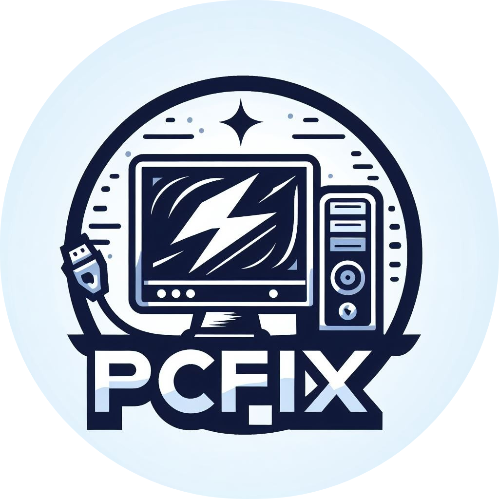
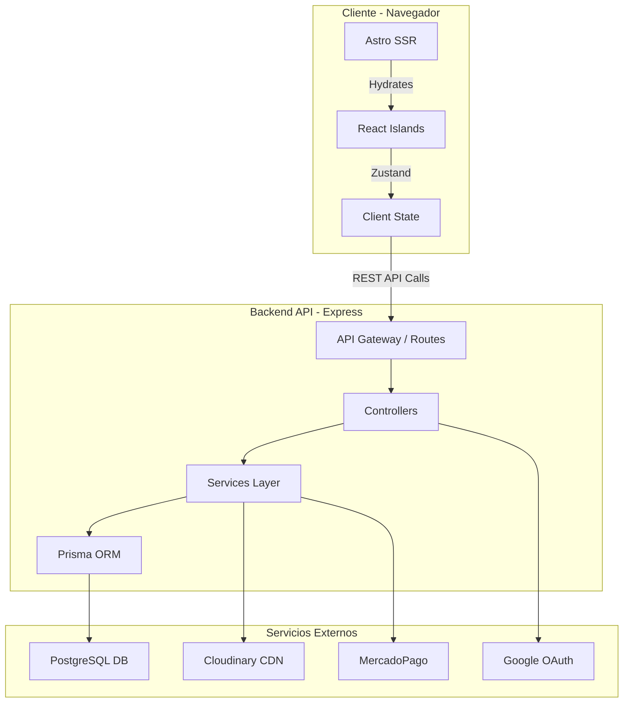

<h1 align="center">🖥️ PCFIX - E-Commerce Monorepo</h1>

<div align="center">
    <a href="https://www.pcfixbaru.com.ar" target="_blank">
        
    </a>
</div>

<p align="center">
    <b>Plataforma integral de comercio electrónico para hardware de alto rendimiento.</b><br>
    <i>Arquitectura Moderna • Alto Rendimiento • Experiencia de Usuario Unificada</i>
</p>

<div align="center">
    <a href="https://www.pcfixbaru.com.ar" target="_blank">
        
    </a>
    <a href="https://github.com/martin-ratti/PCFIX-Baru" target="_blank">
        
    </a>
</div>

<p align="center">
    <a href="https://github.com/martin-ratti" target="_blank">
        
    </a>
</p>

<div align="center">
    
    
    
    
    
    
    
    
    
    
    
    
    
    
    
    
    
    
    
    
    
    
    
    
    
    
    
    
    
    
    
    
    
    
    
</div>

<div align="center">
  
</div>

<hr>

<p align="center">
  <b>Solución de arquitectura moderna para una tienda online de hardware, construida sobre un Monorepo NPM.</b><br>
  Performance extrema con Astro Server Islands + interactividad fluida con React.
</p>

<hr>

<h2>⚡ Sobre el Proyecto</h2>

<p>
    <b>PCFIX</b> no es solo una tienda online, es una solución de arquitectura moderna diseñada para escalar. Construida sobre un <b>Monorepo NPM</b>, el proyecto orquesta una API robusta y un Frontend híbrido de última generación.
</p>

<p>
    El objetivo principal es ofrecer una experiencia de compra instantánea (gracias a <b>Astro Server Islands</b> y SSR) manteniendo una interactividad fluida (con <b>React</b>), todo respaldado por un sistema de gestión administrativo completo.
</p>

<h3>✨ Características Clave</h3>

<ul>
    <li><b>Performance Extrema:</b> Puntuación 95+ en Lighthouse gracias a Astro ViewTransitions y optimización de imágenes.</li>
    <li><b>Gestión de Inventario Real:</b> Control de stock con alertas automáticas y detección de productos inactivos.</li>
    <li><b>Pasarela de Pagos Híbrida:</b> Integración nativa con <b>MercadoPago</b>, Crypto (USDT) y pagos offline.</li>
    <li><b>Admin Dashboard:</b> Panel de control integral con métricas, gráficos y gestión CRUD completa.</li>
</ul>

<hr>

<h2>🛠️ Stack Tecnológico Completo</h2>

<h3>🎨 Frontend (<code>packages/web</code>)</h3>

<table>
 <thead>
  <tr>
   <th>Categoría</th>
   <th>Tecnología</th>
   <th>Uso en el Proyecto</th>
  </tr>
 </thead>
 <tbody>
  <tr>
   <td><b>Core Framework</b></td>
   <td>Astro 5</td>
   <td>Renderizado híbrido (SSR + Static), Enrutamiento por archivos, View Transitions.</td>
  </tr>
  <tr>
   <td><b>UI Library</b></td>
   <td>React 18</td>
   <td>Islas de interactividad (Carrito, Checkout, Modales de Admin, Autenticación).</td>
  </tr>
  <tr>
   <td><b>Estilos</b></td>
   <td>Tailwind CSS</td>
   <td>Sistema de diseño Utility-first, responsive y dark mode ready.</td>
  </tr>
  <tr>
   <td><b>Iconografía</b></td>
   <td>Lucide React</td>
   <td>Librería de iconos vectoriales coherente y ligera.</td>
  </tr>
  <tr>
   <td><b>Estado Global</b></td>
   <td>Zustand</td>
   <td>Gestión de estado ligero y persistente (Carrito, Sesión de Usuario).</td>
  </tr>
  <tr>
   <td><b>Formularios</b></td>
   <td>React Hook Form</td>
   <td>Manejo performante de formularios complejos (Registro, Checkout, Admin).</td>
  </tr>
  <tr>
   <td><b>Validación</b></td>
   <td>Zod</td>
   <td>Esquemas de validación tipados compartidos con el backend.</td>
  </tr>
  <tr>
   <td><b>Gráficos</b></td>
   <td>Recharts</td>
   <td>Visualización de métricas y datos en el Admin Dashboard.</td>
  </tr>
  <tr>
   <td><b>Carousels</b></td>
   <td>Swiper</td>
   <td>Sliders y carousels de productos con gestos táctiles.</td>
  </tr>
  <tr>
   <td><b>Feedback UI</b></td>
   <td>Sonner</td>
   <td>Notificaciones toast elegantes y no intrusivas.</td>
  </tr>
 </tbody>
</table>

<h3>⚙️ Backend (<code>packages/api</code>)</h3>

<table>
 <thead>
  <tr>
   <th>Categoría</th>
   <th>Tecnología</th>
   <th>Uso en el Proyecto</th>
  </tr>
 </thead>
 <tbody>
  <tr>
   <td><b>Servidor</b></td>
   <td>Express 5</td>
   <td>API RESTful moderna, manejo de rutas y middlewares asíncronos.</td>
  </tr>
  <tr>
   <td><b>ORM</b></td>
   <td>Prisma 6</td>
   <td>Capa de acceso a datos type-safe, migraciones y modelado de relaciones complejas.</td>
  </tr>
  <tr>
   <td><b>Base de Datos</b></td>
   <td>PostgreSQL</td>
   <td>Motor de base de datos relacional robusto (Alojado en Railway).</td>
  </tr>
  <tr>
   <td><b>Seguridad</b></td>
   <td>Helmet & CORS</td>
   <td>Protección de headers HTTP y control de acceso de origen cruzado.</td>
  </tr>
  <tr>
   <td><b>Rate Limiting</b></td>
   <td>Express Rate Limit</td>
   <td>Protección contra abuso y ataques de fuerza bruta.</td>
  </tr>
  <tr>
   <td><b>Auth</b></td>
   <td>JWT & Bcrypt</td>
   <td>Autenticación stateless segura y hasheo de contraseñas.</td>
  </tr>
  <tr>
   <td><b>Logging</b></td>
   <td>Morgan</td>
   <td>Registro de peticiones HTTP para depuración y monitoreo.</td>
  </tr>
  <tr>
   <td><b>File Upload</b></td>
   <td>Multer + Cloudinary</td>
   <td>Carga de archivos con almacenamiento en CDN cloud.</td>
  </tr>
  <tr>
   <td><b>Tareas Programadas</b></td>
   <td>Node-cron</td>
   <td>Ejecución de jobs en segundo plano (expiración de reservas, alertas).</td>
  </tr>
  <tr>
   <td><b>HTTP Client</b></td>
   <td>Axios</td>
   <td>Comunicación con servicios externos (MercadoPago, Google, etc).</td>
  </tr>
  <tr>
   <td><b>Compresión</b></td>
   <td>Compression</td>
   <td>Compresión gzip/brotli de respuestas HTTP.</td>
  </tr>
 </tbody>
</table>

<h3>☁️ Servicios e Integraciones</h3>

<table>
 <thead>
  <tr>
   <th>Servicio</th>
   <th>Propósito</th>
   <th>Librería / Implementación</th>
  </tr>
 </thead>
 <tbody>
  <tr>
   <td><b>MercadoPago</b></td>
   <td>Pasarela de Pagos</td>
   <td><code>mercadopago</code> SDK para checkout pro y gestión de pagos.</td>
  </tr>
  <tr>
   <td><b>Cloudinary</b></td>
   <td>CDN de Imágenes</td>
   <td>Almacenamiento y optimización de imágenes de productos en la nube.</td>
  </tr>
  <tr>
   <td><b>Google Auth</b></td>
   <td>Social Login</td>
   <td><code>google-auth-library</code> para autenticación OAuth 2.0.</td>
  </tr>
  <tr>
   <td><b>Resend</b></td>
   <td>Email Transaccional</td>
   <td>Envío de confirmaciones de compra, recuperación de clave y alertas.</td>
  </tr>
  <tr>
   <td><b>Sentry</b></td>
   <td>Monitoreo</td>
   <td>Trazabilidad de errores en tiempo real (Frontend y Backend).</td>
  </tr>
 </tbody>
</table>

<h3>🏗️ Infraestructura y DevOps</h3>

<ul>
    <li><b>Docker & Docker Compose:</b> Contenerización completa del entorno (Web, API, DB) para desarrollo local consistente.</li>
    <li><b>NPM Workspaces:</b> Gestión eficiente de dependencias compartidas y scripts en el monorepo.</li>
    <li><b>Vercel:</b> Deploy del Frontend con edge functions y preview deployments.</li>
    <li><b>Railway:</b> Deploy del Backend y base de datos PostgreSQL en la nube.</li>
    <li><b>Testing Suite:</b>
        <ul>
            <li><b>Vitest:</b> Unit testing ultra rápido para lógica de negocio y componentes.</li>
            <li><b>Playwright:</b> Pruebas End-to-End (E2E) para flujos críticos (Checkout, Login).</li>
        </ul>
    </li>
</ul>

<hr>

<h2>🏛️ Arquitectura del Sistema</h2>



<hr>

<h2>🚀 Instalación y Despliegue Local</h2>

Sigue estos pasos para levantar el entorno completo utilizando Docker (Recomendado).

<h3>1. Clonar el repositorio</h3>

```bash
git clone https://github.com/martin-ratti/PCFIX-Baru.git
cd PCFIX-Baru
```

<h3>2. Configurar variables de entorno</h3>

Crea los archivos `.env` en `packages/api` y `packages/web` basándote en los ejemplos proporcionados en la documentación interna.

<h3>3. Iniciar con Docker Compose</h3>

```bash
docker-compose up --build
```

* 🌐 **Frontend:** `http://localhost:4321`
* 🚀 **API:** `http://localhost:3002`
* 🗄️ **Prisma Studio:** `http://localhost:5555`

<hr>

<h2>🧪 Comandos de Calidad</h2>

<table align="center">
  <thead>
    <tr>
      <th>Comando</th>
      <th>Descripción</th>
    </tr>
  </thead>
  <tbody>
    <tr>
      <td><code>npm run test</code></td>
      <td>Ejecuta tests unitarios en todo el monorepo (Vitest).</td>
    </tr>
    <tr>
      <td><code>npm run e2e</code></td>
      <td>Ejecuta pruebas de integración visuales (Playwright).</td>
    </tr>
    <tr>
      <td><code>npm run lint</code></td>
      <td>Verifica reglas de estilo y errores estáticos.</td>
    </tr>
    <tr>
      <td><code>npm run typecheck</code></td>
      <td>Validación estricta de tipos TypeScript.</td>
    </tr>
  </tbody>
</table>

<hr>

<h2>⚖️ Licencia y Propiedad Intelectual</h2>

<p>
  Este proyecto es <b>propiedad intelectual privada</b> de Martín Ratti. No se otorga ninguna licencia de uso abierto.
</p>

<p>
  <i>⚠️ <b>Restricción:</b> Queda prohibida la copia, reproducción, distribución o modificación de este código sin autorización expresa del autor. Este repositorio se publica exclusivamente como exhibición de portafolio profesional.</i>
</p>

<hr>

<div align="center">
  Desarrollado con 💙 por <b>Martin Ratti</b>
</div>
