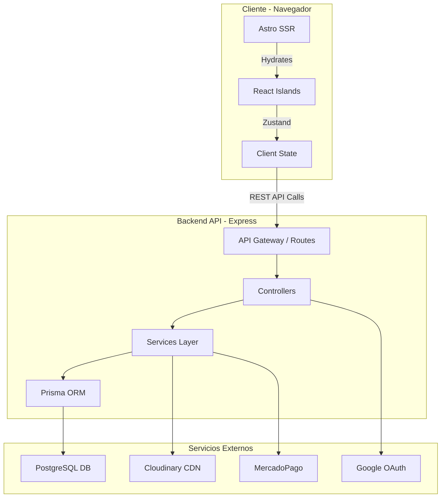

<div align="center">
  <br />
    <a href="https://www.pcfixbaru.com.ar" target="_blank">
      
    </a>
  <br />

  # 🖥️ PCFIX - E-Commerce Monorepo

  **Plataforma integral de comercio electrónico para hardware de alto rendimiento.**
  <br />
  *Arquitectura Moderna • Alto Rendimiento • Experiencia de Usuario Unificada*

  <br />

  <a href="https://www.pcfixbaru.com.ar">
    
  </a>
  <a href="https://github.com/martin-ratti/PCFIX-Baru">
    
  </a>
</div>

<br />

<div align="center">
  
  
  
  <br/>
  
  
  
  <br/>
  
  
  
  <br/>
  
  
  
</div>

---

## ⚡ Sobre el Proyecto

**PCFIX** no es solo una tienda online, es una solución de arquitectura moderna diseñada para escalar. Construida sobre un **Monorepo NPM**, el proyecto orquesta una API robusta y un Frontend híbrido de última generación.

El objetivo principal es ofrecer una experiencia de compra instantánea (gracias a **Astro Server Islands** y SSR) manteniendo una interactividad fluida (con **React**), todo respaldado por un sistema de gestión administrativo completo.

### ✨ Características Clave
* **Performance Extrema:** Puntuación 95+ en Lighthouse gracias a Astro ViewTransitions y optimización de imágenes.
* **Gestión de Inventario Real:** Control de stock con alertas automáticas y detección de productos inactivos.
* **Pasarela de Pagos Híbrida:** Integración nativa con **MercadoPago**, Crypto (USDT) y pagos offline.
* **Admin Dashboard:** Panel de control integral con métricas, gráficos y gestión CRUD completa.

---

## 🛠️ Stack Tecnológico Completo

A continuación, se detalla el ecosistema técnico utilizado en el proyecto, extraído directamente del código fuente.

### 🎨 Frontend (`packages/web`)
| Categoría | Tecnología | Uso en el Proyecto |
| :--- | :--- | :--- |
| **Core Framework** | **Astro 5** | Renderizado híbrido (SSR + Static), Enrutamiento por archivos, View Transitions. |
| **UI Library** | **React 18** | Islas de interactividad (Carrito, Checkout, Modales de Admin, Autenticación). |
| **Estilos** | **Tailwind CSS** | Sistema de diseño Utility-first, responsive y dark mode ready. |
| **Iconografía** | **Lucide React** | Librería de iconos vectoriales coherente y ligera. |
| **Estado Global** | **Zustand** | Gestión de estado ligero y persistente (Carrito, Sesión de Usuario). |
| **Formularios** | **React Hook Form** | Manejo performante de formularios complejos (Registro, Checkout, Admin). |
| **Validación** | **Zod** | Esquemas de validación tipados compartidos con el backend. |
| **Feedback UI** | **Toastify / Custom** | Notificaciones toast no intrusivas para acciones del usuario. |

### ⚙️ Backend (`packages/api`)
| Categoría | Tecnología | Uso en el Proyecto |
| :--- | :--- | :--- |
| **Servidor** | **Express 5** | API RESTful moderna, manejo de rutas y middlewares asíncronos. |
| **ORM** | **Prisma 6** | Capa de acceso a datos type-safe, migraciones y modelado de relaciones complejas. |
| **Base de Datos** | **PostgreSQL** | Motor de base de datos relacional robusto (Alojado en Railway). |
| **Seguridad** | **Helmet & CORS** | Protección de headers HTTP y control de acceso de origen cruzado. |
| **Auth** | **JWT & Bcrypt** | Autenticación stateless segura y hasheo de contraseñas. |
| **Logging** | **Morgan** | Registro de peticiones HTTP para depuración y monitoreo. |
| **File Upload** | **Multer** | Middleware para la gestión de carga de archivos (multipart/form-data). |

### ☁️ Servicios e Integraciones
| Servicio | Propósito | Librería / Implementación |
| :--- | :--- | :--- |
| **MercadoPago** | Pasarela de Pagos | `mercadopago` SDK para checkout pro y gestión de pagos. |
| **Cloudinary** | CDN de Imágenes | Almacenamiento y optimización de imágenes de productos en la nube. |
| **Google Auth** | Social Login | `google-auth-library` para autenticación OAuth 2.0. |
| **Nodemailer** | Email Transaccional | Envío de confirmaciones de compra, recuperación de clave y alertas. |
| **Sentry** | Monitoreo | Trazabilidad de errores en tiempo real (Frontend y Backend). |

### 🏗️ Infraestructura y DevOps
* **Docker & Docker Compose:** Contenerización completa del entorno (Web, API, DB) para desarrollo local consistente.
* **NPM Workspaces:** Gestión eficiente de dependencias compartidas y scripts en el monorepo.
* **CI/CD (GitHub Actions):** Pipelines automatizados para testing y validación de código.
* **Testing Suite:**
    * **Vitest:** Unit testing ultra rápido para lógica de negocio y componentes.
    * **Playwright:** Pruebas End-to-End (E2E) para flujos críticos (Checkout, Login).

---

## 🏛️ Arquitectura del Sistema



---

## 🚀 Instalación y Despliegue Local

Sigue estos pasos para levantar el entorno completo utilizando Docker (Recomendado).

1. **Clonar el repositorio:**
```bash
git clone [https://github.com/martin-ratti/PCFIX-Baru.git](https://github.com/martin-ratti/PCFIX-Baru.git)
cd PCFIX-Baru

```


2. **Configurar variables de entorno:**
Crea los archivos `.env` en `packages/api` y `packages/web` basándote en los ejemplos proporcionados en la documentación interna.
3. **Iniciar con Docker Compose:**
```bash
docker-compose up --build

```


* 🌐 **Frontend:** `http://localhost:4321`
* 🚀 **API:** `http://localhost:3002`
* 🗄️ **Prisma Studio:** `http://localhost:5555`


---

## 🧪 Comandos de Calidad

Asegura la calidad del código antes de enviar cambios:

| Comando | Descripción |
| --- | --- |
| `npm run test` | Ejecuta tests unitarios en todo el monorepo (Vitest). |
| `npm run e2e` | Ejecuta pruebas de integración visuales (Playwright). |
| `npm run lint` | Verifica reglas de estilo y errores estáticos. |
| `npm run typecheck` | Validación estricta de tipos TypeScript. |

---

<div align="center">
Desarrollado con 💙 por <b>Martin Ratti</b>
</div>
